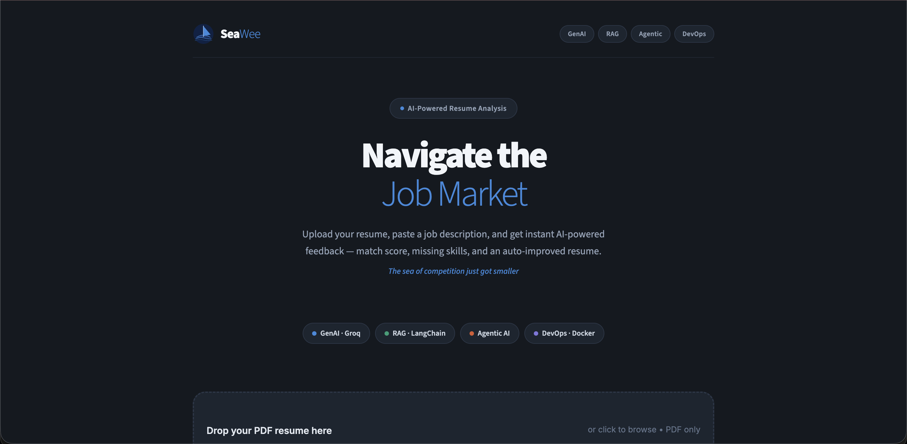
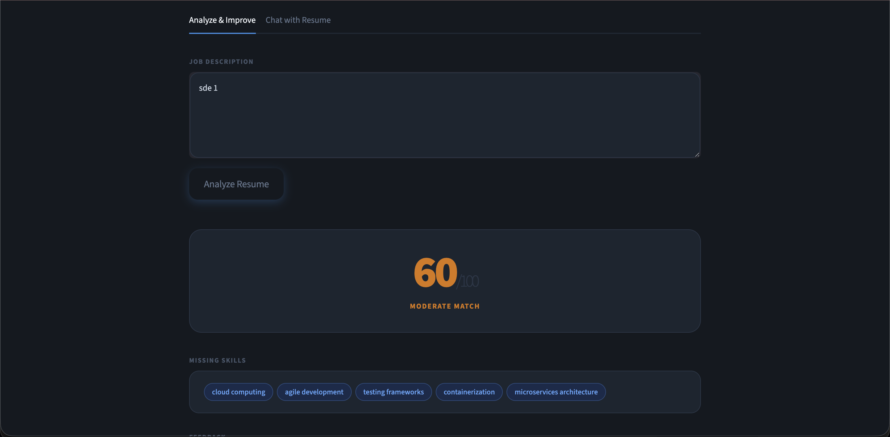
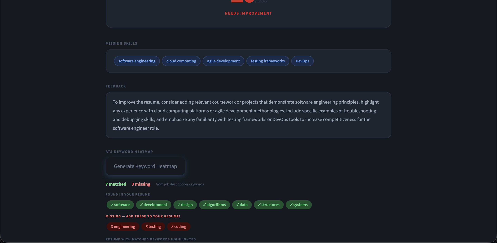
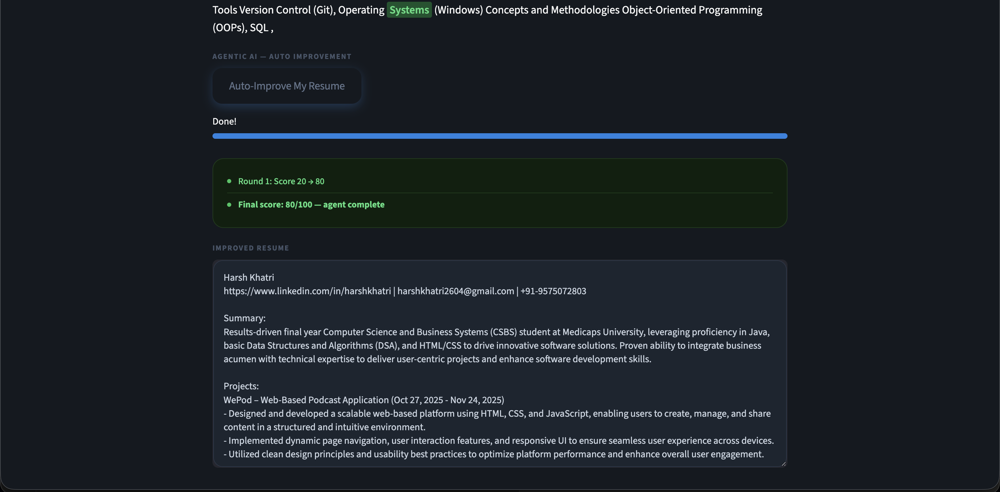
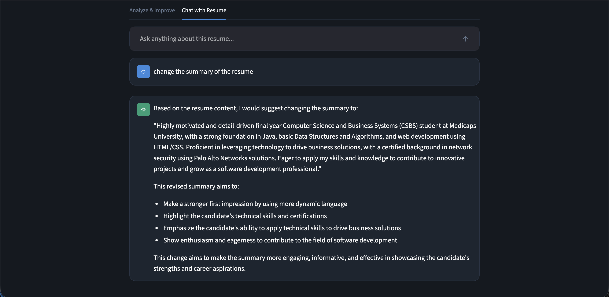

# ⛵ SeaWee — AI-Powered Resume Analyzer

> **The sea of competition just got smaller**

SeaWee is an AI-powered resume analyzer that helps job seekers optimize their resumes against job descriptions. Upload your resume, paste a job description, and get instant feedback — match score, missing skills, keyword heatmap, and an auto-improved resume.



---

## Features

- **Resume Analysis** — Match score out of 100 with detailed feedback
- **Missing Skills Detection** — See exactly which skills are missing from your resume
- **ATS Keyword Heatmap** — Highlights matched keywords green and missing ones red
- **Agentic AI Auto-Improvement** — One click rewrites and improves your resume automatically
- **Chat with Resume** — Ask anything about your resume in a conversational interface

---

## Tech Stack

| Layer | Technology |
|---|---|
| UI | Streamlit + Custom CSS |
| LLM | Groq API — Llama 3 70B |
| RAG | LangChain + ChromaDB |
| Embeddings | HuggingFace all-MiniLM-L6-v2 |
| PDF Extraction | PyPDF2 |
| Containerization | Docker |
| CI/CD | GitHub Actions |

---

## IBM Course Modules Used

| Module | Technology | Feature |
|---|---|---|
| GenAI | Groq Llama 3 | Resume analysis, feedback, rewriting |
| RAG | LangChain + ChromaDB | Market-aware analysis, chat |
| Agentic AI | Python agent loop | Auto-improvement |
| DevOps | Docker + GitHub Actions | Deployment pipeline |

---

## Run Locally

### Step 1 — Clone the repository

```bash
git clone https://github.com/harxh28k/seawee.git
cd seawee
```

### Step 2 — Create a virtual environment (recommended)

**Mac / Linux:**
```bash
python3 -m venv venv
source venv/bin/activate
```

**Windows:**
```bash
python -m venv venv
venv\Scripts\activate
```

### Step 3 — Install dependencies

**Mac / Linux:**
```bash
pip3 install -r requirements.txt
```

**Windows:**
```bash
pip install -r requirements.txt
```

### Step 4 — Get your free Groq API key

1. Go to [console.groq.com](https://console.groq.com)
2. Sign up with Google — it is free, no credit card needed
3. Click **API Keys** in the left sidebar
4. Click **Create API Key**, name it `seawee`, copy it

### Step 5 — Create your .env file

Create a file called `.env` in the root of the project and add:

```
GROQ_API_KEY=your_groq_api_key_here
```

> ⚠️ Never share your API key or push the .env file to GitHub. It is already in .gitignore.

### Step 6 — Run the app

**Mac / Linux:**
```bash
streamlit run app.py
```

**Windows:**
```bash
streamlit run app.py
```

The app will open automatically at `http://localhost:8501`

---

## How to Use

1. Open the app in your browser
2. Upload your resume as a **PDF file**
3. Paste the **job description** of the role you are applying for
4. Click **Analyze Resume** — get your match score, missing skills, and feedback
5. Click **Generate Keyword Heatmap** — see matched and missing keywords visually
6. Click **Auto-Improve My Resume** — agent rewrites your resume automatically
7. Switch to **Chat with Resume** tab — ask anything about your resume

---

## Run with Docker

Make sure Docker is installed on your machine, then:

```bash
# Build the Docker image
docker build -t seawee .

# Run the container
docker run -p 8501:8501 --env-file .env seawee
```

Open `http://localhost:8501` in your browser.

---

## Project Structure

```
seawee/
├── app.py                          # Main Streamlit application
├── rag_engine.py                   # All AI functions (RAG, GenAI, Agent)
├── requirements.txt                # Python dependencies
├── Dockerfile                      # Docker configuration
├── .env.example                    # Example environment file
├── .gitignore                      # Files to exclude from GitHub
└── .github/
    └── workflows/
        └── deploy.yml              # GitHub Actions CI/CD pipeline
```

---

## Requirements

- Python 3.10 or higher
- A free Groq API key from [console.groq.com](https://console.groq.com)
- Internet connection (for Groq API calls)

---

## Common Issues

**`command not found: pip`**
Use `pip3` instead of `pip` on Mac.

**`ModuleNotFoundError`**
Make sure you activated your virtual environment and ran `pip install -r requirements.txt`.

**`GROQ_API_KEY not found`**
Make sure your `.env` file exists in the same folder as `app.py` and contains `GROQ_API_KEY=your_key_here`.

**`File path is not a valid file or url`**
Re-upload your PDF. This happens when the temp file is cleaned up by the OS.

**App opens but shows blank page**
Wait 10-15 seconds for the first load — HuggingFace downloads the embedding model on first run.

---

## Screenshots

| Feature | Screenshot |
|---|---|
| Home Page |  |
| Resume Analysis |  |
| Keyword Heatmap |  |
| Auto Improve |  |
| Chat |  |

---

## Built By

**[Harsh Khatri]**
---

## License

This project is built for educational purposes as a Final Year Project.
